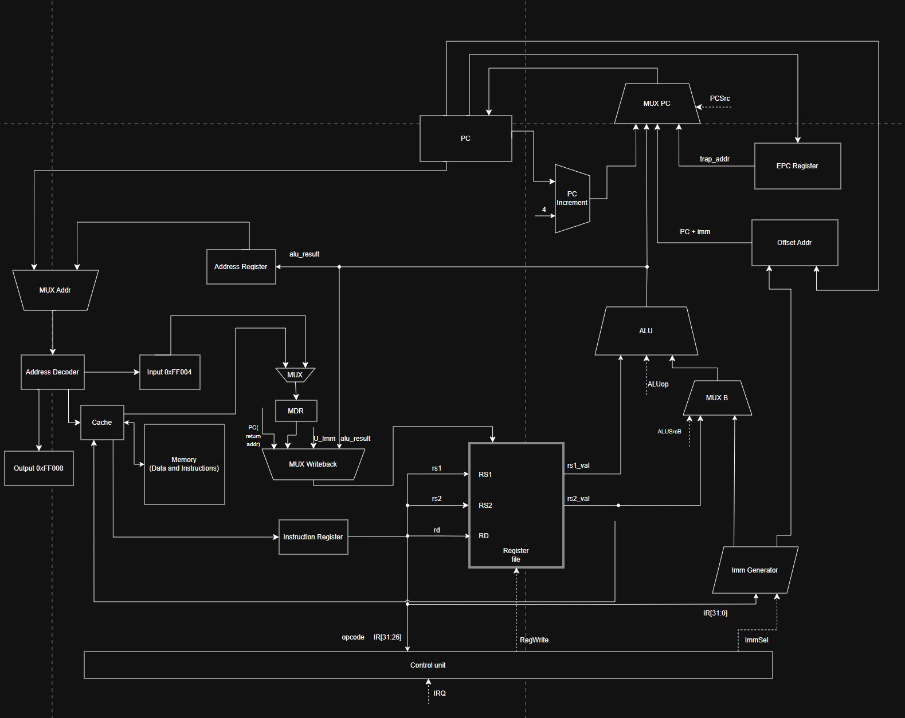
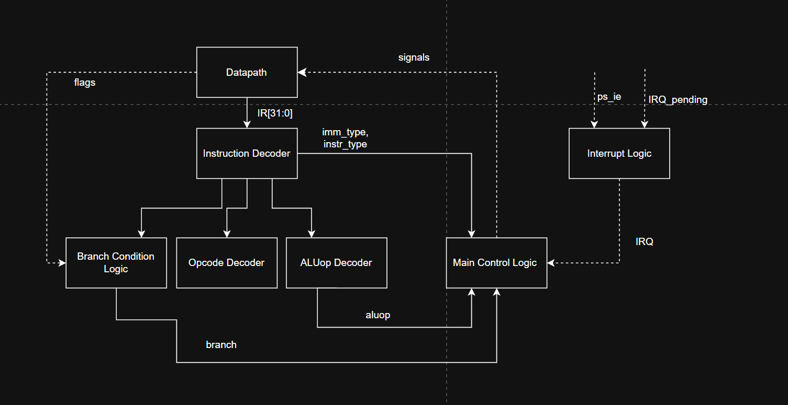

# Лабораторная работа №4.

- **ФИО:** Радченко Алина Александровна
- **Группа:** P3207
- **Вариант:** 
`asm | risc | neum | hw | tick | binary | trap | mem | cstr | prob2 | cache`
---
## Вариант

| Задание | Вариант | Описание                                                                                                                                        |
| :--- | :--- |:------------------------------------------------------------------------------------------------------------------------------------------------|
| **Язык программирования** | `asm` | **Assembly**. Программа на языке ассемблера с использованием мнемоник, меток и прямой работы с регистрами.                                      |
| **Архитектура** | `risc` | **Reduced Instruction Set Computer**. Load/Store архитектура: фиксированная длина команд, операции только над регистрами.                       |
| **Организация памяти** | `neum` | **Фон-неймановская архитектура**. Единое адресное пространство для команд и данных.                                                             |
| **Control Unit** | `hw` | **Hardwired**. Устройство управления реализуется аппаратно в виде конечного автомата (State Machine).                                           |
| **Точность модели** | `tick` | **Потактовое моделирование**. Симуляция процессора с точностью до такта, логирование состояния на каждом шаге.                                  |
| **Представление кода** | `binary` | **Бинарный формат**. Транслятор генерирует исполняемый файл в виде последовательности машинных слов (чисел).                                    |
| **Ввод-вывод** | `trap` | **Прерывания**. Взаимодействие с внешними устройствами через механизм прерываний и системных вызовов.                                           |
| **Ввод-вывод ISA** | `mem` | **Memory-mapped I/O**. Обращение к портам ввода-вывода осуществляется через обычные команды работы с памятью (по специальным адресам).          |
| **Поддержка строк** | `cstr` | **Null-terminated strings**. Строки хранятся как последовательность байт, оканчивающаяся нулевым символом `\0`.                                 |
| **Алгоритм** | `prob2` | **Sum square difference**. Разность суммы квадратов первых 100 натуральных чисел и квадрата суммы первых 100 натуральных чисел. Euler problem 6 |
| **Кэш** | `cache` | **Cache** работа с памятью реализуется через кеш                                                                                                |                                                                                                                                       |
---
## Язык программирования

### Общая характеристика
В проекте реализован язык ассемблера для разработанной RISC-архитектуры. Код пишется строка за строкой, транслятор переводит каждую инструкцию в одно 32-битное машинное слово.

Язык поддерживает:
*   **Директивы секций:** `.section .data` и `.section .text` для разделения данных и машинного кода.
*   **Директивы данных:** `.word` для 32-битных чисел и `.string` для нуль-терминированных строк (C-strings).
*   **Метки (Labels):** используются для обозначения адресов данных, точек перехода и вызовов подпрограмм.
*   **Регистры:** прямое обращение к 32 регистрам (`x0`...`x31` или их ABI-алиасам `zero`, `ra`, `sp`, `t0`–`t6`, `a0`–`a7`, `s0`–`s11`).
*   **Комментарии:** начинаются с символа `;` и игнорируются транслятором.
*   **Препроцессор:** поддержка макросов и условной компиляции (см. раздел ниже).
---
### Типы данных
Так как разработанный язык является низкоуровневым ассемблером, в нём отсутствует строгая система типов. Вся ответственность за интерпретацию памяти лежит на программисте. Аппаратура и транслятор концептуально оперируют следующими типами данных:

*   **Машинное слово (Word):** 32-битное знаковое целое число. Основной тип данных, с которым работает АЛУ и который используется для адресации памяти. В секции данных задается директивой `.word`.
*   **Байт / Символ (Byte / Char):** 8-битное значение. Используется преимущественно для хранения ASCII-символов в строках формата `cstr`. Чтение байта из памяти осуществляется инструкцией `lb` (Load Byte, со знаковым расширением до 32 бит), а запись — `sb` (Store Byte).
*   **Двойное слово (64-битное число):** Так как базовые регистры 32-битные, для вычислений, превышающих лимит в ~2.14 млрд (что актуально для алгоритма `prob2`), 64-битные числа реализуются программно. Одно 64-битное число хранится в **паре** 32-битных регистров (например, `t0` для младшей части, `t1` для старшей). Сложение таких чисел учитывает флаг переноса (`C` — Carry), который устанавливается АЛУ при переполнении младшей части.

---

### Семантика

**Стратегия вычислений** - строго последовательная (императивная). Каждая инструкция выполняется полностью до начала следующей. Порядок выполнения определяется счётчиком команд `PC`; инструкции перехода (`beq`, `bne`, `jal`, `jalr` и др.) изменяют `PC`.

**Области видимости** - глобальные. Метки (`label:`) видны во всём файле после первого прохода транслятора.

**Литералы:**
*   **Числа:** десятичные и шестнадцатеричные (`0x...`). Если число помещается в поле `immediate` инструкции (например, 15 бит для I-типа), оно встраивается прямо в машинный код. Большие числа или числа, используемые многократно, должны размещаться в секции `.data` директивой `.word`.
*   **Строки:** хранятся только в секции `.data` как C-строки (`cstr`). Директива `.string "abc"` размещает в памяти последовательность символов, завершённую нулевым байтом (`\0`).

**Константы:** объявляются директивой `.equ NAME VALUE` — добавляют символ в таблицу меток, не занимают память. Могут использоваться как немедленные операнды в любом месте программы.

**Переменные:** объявляются директивой `.word` в секции `.data` (для глобальных/статических) или размещаются на стеке путём манипуляции с указателем `sp` (для локальных). Каждая занимает одно 32-битное машинное слово.

**Процедуры:** вызываются инструкциями `jal` и `jalr`. Адрес возврата аппаратно сохраняется в регистр `ra` (Return Address). Завершаются инструкцией `jalr zero, ra, 0`, которая загружает в `PC` сохранённый адрес.

**Прерывания:** программное прерывание вызывается инструкцией `trap` (вектор `0x04`), аппаратное - внешним сигналом (вектор `0x08`). При прерывании аппаратно сохраняется `PC + 4` в регистр `EPC`, сбрасывается флаг `PS.IE` и загружается адрес обработчика. Завершается инструкцией `iret` (восстанавливает `PC` из `EPC` и флаг `PS.IE`).

---
### Синтаксис (BNF)

```bnf
<program>      ::= { <line> }

<line>         ::= [ <label> ] [ <statement> ] [ <comment> ] "\n"

<statement>    ::= <r_instr>
                 | <i_alu_instr>
                 | <load_instr>
                 | <store_instr>
                 | <branch_instr>
                 | <jal_instr>
                 | <jalr_instr>
                 | <lui_instr>
                 | <sys_instr>
                 | <pseudo_instr>
                 | <directive>
                 | <preprocessor>
                 | <macro_call>

<label>        ::= <identifier> ":"

<comment>      ::= ";" { <any_char> }

<r_instr>      ::= <opcode_r> <reg> "," <reg> "," <reg>
                 | "cmp"      <reg> "," <reg>

<i_alu_instr>  ::= <opcode_i> <reg> "," <reg> "," <imm13>

<load_instr>   ::= <opcode_l> <reg> "," <imm13> "(" <reg> ")"

<store_instr>  ::= <opcode_s> <reg> "," <imm13> "(" <reg> ")"

<branch_instr> ::= <opcode_b> <reg> "," <reg> "," <label_ref>

<jal_instr>    ::= "jal"  <reg> "," <label_ref>

<jalr_instr>   ::= "jalr" <reg> "," <reg> "," <imm13>

<lui_instr>    ::= "lui"  <reg> "," <imm21>

<sys_instr>    ::= "trap" | "iret" | "halt"

<pseudo_instr> ::= "mv"   <reg> "," <reg>
                 | "j"    <label_ref>
                 | "jr"   <reg>
                 | "beqz" <reg> "," <label_ref>
                 | "bnez" <reg> "," <label_ref>
                 | "bgtu" <reg> "," <reg> "," <label_ref>
                 | "bleu" <reg> "," <reg> "," <label_ref>

<opcode_r>     ::= "add" | "sub" | "mul" | "mulh" | "div" | "rem"
                 | "and" | "or"  | "xor"
                 | "sll" | "srl" | "sra"
                 | "cmp"

<opcode_i>     ::= "addi" | "andi" | "ori" | "xori" | "slti"
                 | "slli" | "srli" | "srai"

<opcode_l>     ::= "lw" | "lb"

<opcode_s>     ::= "sw" | "sb"

<opcode_b>     ::= "beq"  | "bne"  | "blt"  | "bge"
                 | "ble"  | "bgt"  | "blo"  | "bgeu"

<opcode_pseudo>::= "mv" | "j" | "jr"
                 | "beqz" | "bnez"
                 | "bgtu" | "bleu"

<reg>          ::= "x0"  | "x1"  | "x2"  | "x3"
                 | "x4"  | "x5"  | "x6"  | "x7"
                 | "x8"  | "x9"  | "x10" | "x11"
                 | "x12" | "x13" | "x14" | "x15"
                 | "x16" | "x17" | "x18" | "x19"
                 | "x20" | "x21" | "x22" | "x23"
                 | "x24" | "x25" | "x26" | "x27"
                 | "x28" | "x29" | "x30" | "x31"
                 | "zero" | "ra" | "sp" | "gp" | "tp"
                 | "t0" | "t1" | "t2"
                 | "s0" | "fp" | "s1"
                 | "a0" | "a1" | "a2" | "a3"
                 | "a4" | "a5" | "a6" | "a7"
                 | "s2"  | "s3"  | "s4"  | "s5"
                 | "s6"  | "s7"  | "s8"  | "s9"
                 | "s10" | "s11"
                 | "t3" | "t4" | "t5" | "t6"

<directive>    ::= ".section" <section_name>
                 | ".org"     <number>
                 | ".equ"     <identifier> <number>
                 | ".word"    <number> { "," <number> }
                 | ".string"  <string_literal>

<section_name> ::= ".text" | ".data"

<preprocessor> ::= ".define" <identifier> <token>
                 | ".undef"  <identifier>
                 | ".ifdef"  <identifier>
                 | ".ifndef" <identifier>
                 | ".else"
                 | ".endif"
                 | ".macro"  <identifier> { <identifier> }
                 | ".endm"

<macro_call>   ::= <identifier> { <token> }

<imm13>        ::= <number>
                 | "%lo(" <identifier> ")"
                 | "%hi(" <identifier> ")"

<imm21>        ::= <number>
                 | "%hi(" <identifier> ")"

<label_ref>    ::= <identifier>

<token>        ::= <number> | <identifier>

<number>       ::= [ "-" ] <dec_number>
                 | [ "-" ] <hex_number>

<dec_number>   ::= <digit> { <digit> }

<hex_number>   ::= "0x" <hex_digit> { <hex_digit> }

<string_literal>::= '"' { <string_char> } '"'

<string_char>  ::= <any_char_except_quote_and_newline>
                 | "\\" <escape_char>

<escape_char>  ::= "n" | "t" | "r" | "\\" | '"' | "0"

<identifier>   ::= ( <letter> | "_" ) { <letter> | <digit> | "_" }

<letter>       ::= "a" | "b" | "c" | "d" | "e" | "f" | "g" | "h"
                 | "i" | "j" | "k" | "l" | "m" | "n" | "o" | "p"
                 | "q" | "r" | "s" | "t" | "u" | "v" | "w" | "x"
                 | "y" | "z"
                 | "A" | "B" | "C" | "D" | "E" | "F" | "G" | "H"
                 | "I" | "J" | "K" | "L" | "M" | "N" | "O" | "P"
                 | "Q" | "R" | "S" | "T" | "U" | "V" | "W" | "X"
                 | "Y" | "Z"

<digit>        ::= "0" | "1" | "2" | "3" | "4"
                 | "5" | "6" | "7" | "8" | "9"

<hex_digit>    ::= <digit>
                 | "a" | "b" | "c" | "d" | "e" | "f"
                 | "A" | "B" | "C" | "D" | "E" | "F"
```
---
## Организация памяти

### Модель памяти
В системе реализована **фон-неймановская архитектура**: память команд и память данных находятся в едином физическом и логическом адресном пространстве.

*   **Размер машинного слова:** 32 бита (4 байта).
*   **Размер инструкции:** 32 бита (фиксированная длина для архитектуры RISC).
*   **Адресация:** 32-битная, байтовая. Обращение к памяти (за инструкциями или машинными словами) требует выравнивания по 4 байтам (адрес должен быть кратен 4).
---
### Разбиение адресного пространства

| Область | Адрес | Назначение |
| :--- | :--- | :--- |
| `.text` | `0x0000_0000` | Секция кода целиком. Включает таблицу векторов прерываний и инструкции программы. |
| ↳ `trap_table` | `0x0000_0000–0x0000_00FF` | Первые 256 байт `.text`: слова с адресами обработчиков (`0x04` — `trap`, `0x08` — аппаратное прерывание). |
| ↳ код программы | `0x0000_0100` | Точка входа `_start` и тело программы. PC процессора инициализируется сюда. |
| `.data` | `0x0001_0000` | Глобальные переменные, массивы (`.word`) и строковые литералы в формате `cstr`. |
| `stack_top` | `0x000F_0000` | Начальная вершина стека (значение для инициализации `sp`); стек растёт вниз. |
| `mmio` | `0x000F_F000` | Memory-mapped I/O регистры для общения с внешними устройствами (порты данных и статуса). |
---
### Схема распределения памяти
Так как архитектура фон-неймановская, все данные, код, стек и порты ввода-вывода (MMIO) отображаются в единое адресное пространство размером 4 ГБ.

```text
Main Memory (4 GB)
0x0000_0000
+--------------------------------------------------+
| .text (Исполняемый код)                          |
|                                                  |
| 0x0000_0000 : trap vector table                  |
|          +0x04 -> адрес обработчика trap         |
|          +0x08 -> адрес обработчика hardware IRQ |
|                                                  |
| 0x0000_0100 : _start                             |
|          основной код программы                  |
|                                                  |
| label:   пользовательские подпрограммы (jal)     |
|                                                  |
| handler: обработчики прерываний                  |
+--------------------------------------------------+
0x0001_0000
+--------------------------------------------------+
| .data (Статические данные)                       |
|                                                  |
| global_var: глобальные переменные (.word)        |
|                                                  |
| str_label: строковые литералы (формат cstr)      |
|   +0 : char[0] (в 32-битном машинном слове)      |
|   +4 : char[1] (в 32-битном машинном слове)      |
|   ...                                            |
|   +N : '\0'    (нулевой терминатор, 32 бита)     |
+--------------------------------------------------+
                 ... unused ...
0x000E_FFFF
+--------------------------------------------------+
| stack (Стек - динамические данные функций)       |
|                                                  |
| локальные переменные функций                     |
| сохраненные регистры (ra, s0-s11)                |
| стек растет вниз (от 0x000F_0000)                |
+--------------------------------------------------+
0x000F_F000
+--------------------------------------------------+
| MMIO (Порты ввода-вывода)                        |
| +0x00 : MMIO_IN_STATUS  (read-only)              |
| +0x04 : MMIO_IN_DATA    (read-only)              |
| +0x08 : MMIO_OUT_DATA   (write-only)             |
| +0x0c : MMIO_OUT_STATUS (read-only)              |
| +0x10 : MMIO_IRQ_ACK    (write-only)             |
+--------------------------------------------------+
```

---

### Формат строк `cstr`

Строка хранится как последовательность байт (символов), которая завершается нулевым символом (`\0`). Согласно варианту, каждый символ, включая терминирующий ноль, размещается в отдельном 32-битном машинном слове для упрощения адресации.

```text
addr + 0  : char[0]
addr + 4  : char[1]
addr + 8  : char[2]
...
addr + n*4: '\0'      (нулевой символ-терминатор)
```
---
### MMIO (Memory-Mapped I/O)

Регистры ввода-вывода отображаются в общее адресное пространство, начиная с базового адреса `mmio_base = 0x000F_F000`.

| Смещение от `mmio_base` | Имя | Доступ | Назначение |
| :--- | :--- | :--- | :--- |
| **0x00** | `MMIO_IN_STATUS` | read-only | `1` если в регистре ввода есть непрочитанный байт, иначе `0`. |
| **0x04** | `MMIO_IN_DATA` | read-only | Чтение байта из однослотового регистра ввода. Если регистр пуст — устанавливает `eof`. |
| **0x08** | `MMIO_OUT_DATA` | write-only | Запись младшего байта отправляет символ на устройство вывода. |
| **0x0c** | `MMIO_OUT_STATUS` | read-only | Выходное устройство готово к приёму нового символа. |
| **0x10** | `MMIO_IRQ_ACK` | write-only | Запись ненулевого значения очищает регистр ввода `MMIO_IN_DATA`. |


---

### Система прерываний и Trap

#### Общая идея

Взаимодействие с внешними устройствами в данном варианте реализовано через асинхронный ввод, управляемый аппаратными прерываниями. Внешнее устройство ввода (симулируемое моделью) работает по заранее определённому расписанию (schedule), например: `[(100, 'H'), (180, 'e'), ...]`.

Порт ввода реализован как **однослотовый аппаратный регистр** (`MMIO_IN_DATA`): устройство записывает в него байт и прерывание становится активным. Если процессор не успел прочитать предыдущий байт до прихода следующего — старый байт **теряется** (перезаписывается новым). Никакой буферизации нет — поведение аналогично реальному UART без FIFO.

#### Trap-регистры и флаги

Для обработки прерываний в архитектуре используются следующие регистры и флаги:

| Элемент          | Назначение                                                                                                                                              |
|:---------------|:------------------------------------------------------------------------------------------------------------------------------------------------------|
| **`PS.IE`**      | Флаг **Interrupt Enable** в регистре состояния `PS`. Глобально разрешает (`1`) или запрещает (`0`) аппаратные прерывания.                                 |
| **`EPC`**        | **Exception Program Counter**. Хранит адрес инструкции, к которой нужно вернуться после завершения обработчика (`PC+4` на момент прерывания).         |
| **`trap_table`** | Таблица векторов прерываний, расположенная по базовому адресу `0x0000_0000`. В данном варианте используется два вектора: `0x04` для программного `trap` и `0x08` для аппаратного прерывания от внешнего устройства. |
| **`MMIO_IN_DATA`** | Однослотовый аппаратный регистр данных. Наличие данных в нём (`≠ None`) является сигналом прерывания. Новый байт перезаписывает непрочитанный. |

**Вход в обработчик прерывания разрешён только при выполнении условия:**

`MMIO_IN_DATA не пуст` **И** `PS.IE == 1`

Вложенные прерывания аппаратно запрещены: при входе в обработчик флаг `PS.IE` автоматически сбрасывается в `0`.

#### Последовательность обработки аппаратного прерывания

1.  **Запрос прерывания.** Внешнее устройство записывает байт в однослотовый регистр `MMIO_IN_DATA`. Если предыдущий байт не был прочитан — он теряется.

2.  **Обнаружение.** Перед каждой фазой **Fetch** аппаратный Control Unit проверяет условие `MMIO_IN_DATA не пуст && PS.IE`. Текущая инструкция всегда завершается полностью — прерывание возникает только на границе инструкций.

3.  **Вход в Trap (фаза `TrapEnter`).** Вместо выборки следующей инструкции (`Fetch`), процессор выполняет атомарную последовательность действий:
    *   Сохраняет адрес возврата в `EPC`: `EPC <- PC`.
    *   Запрещает дальнейшие прерывания: `PS.IE <- 0`.
    *   Загружает адрес обработчика из таблицы векторов: `PC <- MEM[0x08]`.

4.  **Выполнение обработчика.** Процессор исполняет код обработчика прерываний. Обработчик должен:
    *   Прочитать байт из `MMIO_IN_DATA`.
    *   Записать ненулевое значение в `MMIO_IRQ_ACK` — это очищает регистр `MMIO_IN_DATA`.

5.  **Возврат из прерывания.** Обработчик завершается инструкцией `iret`. При её выполнении процессор аппаратно и атомарно:
    *   Восстанавливает счётчик команд: `PC <- EPC`.
    *   Снова разрешает прерывания: `PS.IE <- 1`.

Исполнение основной программы возобновляется с инструкции, следующей за той, на которой произошло прерывание.


#### Стандартный обработчик ввода (Default Input Handler)

Так как язык — ассемблер, "runtime" представляет собой набор стандартных подпрограмм. Стандартный обработчик прерывания ввода выполняет следующие шаги:

1.  **Сохранить контекст:** Сохранить в стек значения всех временных регистров, которые могут быть использованы в обработчике.
2.  **Прочитать байт** из `MMIO_IN_DATA`.
3.  **Подтвердить ввод**, записав `1` в `MMIO_IRQ_ACK`.
4.  **Поместить байт в программный буфер** (например, кольцевой буфер в секции `.data`).
5.  **Восстановить контекст**, извлекая значения регистров из стека.
6.  **Выполнить `iret`** для возврата в прерванный код.

#### Пример пользовательского обработчика

Программист может определить собственный обработчик, разместив его по адресу, указанному в векторе прерываний.

```assembly
hw_trap_handler:
    addi    sp, sp, -8
    sw      t0, 4(sp)
    sw      t1, 0(sp)

    lui     t0, 0x00FF
    lw      t1, 4(t0)
    sw      t1, 8(t0)

    addi    t1, zero, 1
    sw      t1, 16(t0)

    lw      t1, 0(sp)
    lw      t0, 4(sp)
    addi    sp, sp, 8

    iret
```

---

## Система команд

Особенности архитектуры:
* **Тип архитектуры:** RISC (Load/Store архитектура).
* **Длина машинного слова и инструкции:** 32 бита.
* **Доступ к памяти:** только через специальные инструкции `Load` и `Store`. Арифметические команды работают исключительно с регистрами.
* В процессоре предусмотрено 32 регистра общего назначения. `x0`/`zero` жёстко привязан к нулю. `x2`/`sp` — указатель стека, `x1`/`ra` — адрес возврата.

## Регистры

Процессор содержит 32 регистра общего назначения (GPR) и несколько управляющих регистров, вынесенных за пределы основного файла.

### Регистры общего назначения (GPR)

| Номер | x-имя | ABI-имя | Назначение |
| :---: | :--- | :--- | :--- |
| 0 | `x0` | `zero` | **Hardwired Zero**: всегда равен 0. Запись игнорируется. |
| 1 | `x1` | `ra` | **Return Address**: адрес возврата. |
| 2 | `x2` | `sp` | **Stack Pointer**: указатель на вершину стека (растёт вниз). |
| 3 | `x3` | `gp` | **Global Pointer**. |
| 4 | `x4` | `tp` | **Thread Pointer**. |
| 5–7 | `x5–x7` | `t0–t2` | **Temporaries**: временные регистры. |
| 8–9 | `x8–x9` | `s0`/`fp`, `s1` | **Saved / Frame Pointer**: сохраняемые между вызовами. |
| 10–17 | `x10–x17` | `a0–a7` | **Arguments / Return values**: аргументы функций и возвращаемые значения. |
| 18–27 | `x18–x27` | `s2–s11` | **Saved registers**: сохраняемые между вызовами. |
| 28–31 | `x28–x31` | `t3–t6` | **Temporaries**: дополнительные временные регистры. |

### Специальные регистры

| Регистр | Описание |
| :--- | :--- |
| `PC` | **Program Counter**: хранит адрес текущей (или следующей) исполняемой инструкции. |
| `IR` | **Instruction Register**: хранит текущую 32-битную инструкцию, загруженную из памяти на стадии *Fetch*. Control Unit (декодер) читает биты опкода именно отсюда. |
| `AR` | **Address Register**: буферный регистр, хранящий вычисленный адрес для обращения к памяти (чтение/запись данных или выборка следующей команды). |
| `EPC` | **Exception Program Counter**: хранит адрес возврата (`PC`) при аппаратном переходе в обработчик прерывания (`trap`). Используется командой `iret` для возврата. |
| `PS` | **Program Status**: регистр состояния процессора. Хранит флаги АЛУ (**N**, **Z**, **V**, **C**), а также флаг разрешения прерываний **IE** (Interrupt Enable). |


### Флаги состояния (NZVC)
Флаги обновляются после каждой арифметико-логической операции:
* **N** (Negative): устанавливается, если результат операции отрицательный (старший бит = 1).
* **Z** (Zero): устанавливается, если результат операции равен 0.
* **V** (Overflow): устанавливается в случае знакового переполнения (результат не влезает в разрядную сетку).
* **C** (Carry): устанавливается в случае беззнакового переноса из старшего разряда (переполнение для беззнаковых чисел).

## Структура машинного слова

Инструкции имеют фиксированную длину 32 бита. Номера регистров (`Rd`, `Rs1`, `Rs2`) всегда занимают одни и те же позиции, что упрощает аппаратную реализацию декодера.
### Описание полей

*   **Opcode (6 бит)**: Код операции.
*   **Rd (5 бит)**: Регистр назначения.
*   **Rs1, Rs2 (5 бит каждый)**: Регистры-источники.
*   **funct3 (3 бита)**: Уточнение операции АЛУ.
*   **funct7 (8 бит)**: Расширенный код для R-типа.
*   **Immediate (imm)**: Знаково расширяемая константа:
    *   В **I-типе** — 13 бит (диапазон −4096..+4095).
    *   В **S/B-типах** — 13 бит, разделённых на два поля (4 + 9 бит), чтобы сохранить позиции Rs1/Rs2.
    *   В **U/J-типах** — 21 бит.

### Форматы инструкций
Опкод всегда в битах [31:26]. Номера регистров во всех форматах — в фиксированных позициях.

| Формат | Назначение | Структура (32 бита) |
| :--- | :--- | :--- |
| **R** | Операции АЛУ (регистр–регистр) | `[opcode:6][rd:5][rs1:5][rs2:5][funct3:3][funct7:8]` |
| **I** | ALU с константой, Load, JALR, SYS | `[opcode:6][rd:5][rs1:5][funct3:3][imm:13]` |
| **S** | Store | `[opcode:6][imm[12:9]:4][rs1:5][rs2:5][funct3:3][imm[8:0]:9]` |
| **B** | Условные переходы (Branch) | `[opcode:6][imm[12:9]:4][rs1:5][rs2:5][funct3:3][imm[8:0]:9]` |
| **U** | LUI, JAL | `[opcode:6][rd:5][imm:21]` |

### Набор инструкций

#### 1. Загрузка констант
| Инструкция | Формат | Описание | Семантика |
| :--- | :--- | :--- | :--- |
| `lui rd, imm20` | U | Load Upper Immediate | `rd = imm20 << 12`. |

#### 2. Доступ к памяти (Load / Store)
Адрес вычисляется как `rs1 + imm12`.

| Инструкция              | Формат | Описание | Семантика                      |
|:------------------------|:-------| :--- |:-------------------------------|
| `lw rd, imm12(rs1)`     | I      | Load Word | `rd = MEM[rs1 + imm12]`        |
| `sw rs2, imm12(rs1)`    | S      | Store Word | `MEM[rs1 + imm12] = rs2`       |
| `lb rd, imm12(rs1)`     | I      | Load Byte | `rd = SignExt(MEM[rs1 + imm12][7:0])` |
| `sb rs2, imm12(rs1)`    | S      | Store Byte | `MEM[rs1 + imm12][7:0] = rs2[7:0]`  |


#### 3. Арифметические и логические операции (ALU)

Все операции этой группы записывают результат в регистр `rd` и обновляют флаги **NZVC**.

| Инструкция | Формат | Описание | Семантика |
| :--- | :--- | :--- | :--- |
| `add rd, rs1, rs2`  | R | Сложение | `rd = rs1 + rs2` |
| `sub rd, rs1, rs2`  | R | Вычитание | `rd = rs1 - rs2` |
| `mul rd, rs1, rs2`  | R | Умножение (мл. 32 бита) | `rd = rs1 * rs2` |
| `mulh rd, rs1, rs2` | R | Умножение (ст. 32 бита) | `rd = (rs1 * rs2) >> 32` (знаковое) |
| `div rd, rs1, rs2`  | R | Деление | `rd = rs1 / rs2` (знаковое) |
| `rem rd, rs1, rs2`  | R | Остаток от деления | `rd = rs1 % rs2` (знаковое) |
| `and rd, rs1, rs2`  | R | Побитовое И | `rd = rs1 & rs2` |
| `or rd, rs1, rs2`   | R | Побитовое ИЛИ | `rd = rs1 \| rs2` |
| `xor rd, rs1, rs2`  | R | Побитовое XOR | `rd = rs1 ^ rs2` |
| `cmp rs1, rs2`      | R | Сравнение | только флаги (`rs1 - rs2`, `rd` не пишется) |
| `addi rd, rs1, imm` | I | Сложение с константой | `rd = rs1 + imm` |
| `andi rd, rs1, imm` | I | Побитовое И с константой | `rd = rs1 & imm` |
| `ori  rd, rs1, imm` | I | Побитовое ИЛИ с константой | `rd = rs1 \| imm` |
| `xori rd, rs1, imm` | I | Побитовое XOR с константой | `rd = rs1 ^ imm` |
| `slti rd, rs1, imm` | I | Set-Less-Than (знаковое) | `rd = (rs1 < imm) ? 1 : 0` |

#### 4. Операции сдвига

Величина сдвига у R-инструкций — значение `rs2 & 0x1F`, у I-инструкций — `imm & 0x1F`.

| Инструкция | Формат | Описание | Семантика |
| :--- | :--- | :--- | :--- |
| `sll rd, rs1, rs2`  | R | Shift Left Logical | `rd = rs1 << (rs2 & 31)` |
| `srl rd, rs1, rs2`  | R | Shift Right Logical | `rd = (unsigned)rs1 >> (rs2 & 31)` |
| `sra rd, rs1, rs2`  | R | Shift Right Arithmetic | `rd = (signed)rs1 >> (rs2 & 31)` |
| `slli rd, rs1, imm` | I | Сдвиг влево на константу | `rd = rs1 << (imm & 31)` |
| `srli rd, rs1, imm` | I | Логический сдвиг вправо на константу | `rd = (unsigned)rs1 >> (imm & 31)` |
| `srai rd, rs1, imm` | I | Арифметический сдвиг вправо на константу | `rd = (signed)rs1 >> (imm & 31)` |

#### 5. Управление потоком
Все переходы являются относительными (относительно текущего `PC`).

| Инструкция | Формат | Описание | Семантика |
| :--- | :--- | :--- | :--- |
| `beq rs1, rs2, imm` | B | Branch if Equal | Если `rs1 == rs2`, то `PC += imm` |
| `bne rs1, rs2, imm` | B | Branch if Not Equal| Если `rs1 != rs2`, то `PC += imm` |
| `blt rs1, rs2, imm` | B | Branch if Less Than | Если `rs1 < rs2`, то `PC += imm` |
| `bge rs1, rs2, imm` | B | Branch if Greater or Equal | Если `rs1 >= rs2`, то `PC += imm` |
| `ble rs1, rs2, imm` | B | Branch if Less or Equal | Если `rs1 <= rs2` (знаковое), то `PC += imm` |
| `bgt rs1, rs2, imm` | B | Branch if Greater Than | Если `rs1 > rs2` (знаковое), то `PC += imm` |
| `blo rs1, rs2, imm` | B | Branch if Lower (Unsigned) | Если `rs1 < rs2` (беззнаковое, C=1), то `PC += imm` |
| `bgeu rs1, rs2, imm` | B | Branch if Greater or Equal (Unsigned) | Если `rs1 >= rs2` (беззнаковое, C=0), то `PC += imm` |
| `jal rd, imm20` | J | Jump and Link | Сохранить адрес возврата `rd = PC + 4` и прыгнуть: `PC += imm20` |
| `jalr rd, rs1, imm` | I | Jump and Link Reg | Сохранить адрес возврата `rd = PC + 4` и прыгнуть: `PC = rs1 + imm` |

#### 6. Системные и прерывания (Trap)
| Инструкция | Формат | Описание | Семантика |
| :--- | :--- | :--- | :--- |
| `trap` | I | Системный вызов | `EPC ← PC`, `IE ← 0`, `PC ← MEM[0x04]` |
| `iret` | I | Возврат из Trap | `PC ← EPC`, `IE ← 1` |
| `halt` | I | Остановка машины | Аппаратная остановка симуляции. |

#### 7. Псевдоинструкции

Раскрываются транслятором в одну реальную инструкцию.

| Псевдо | Раскрытие | Описание |
| :--- | :--- | :--- |
| `mv rd, rs` | `addi rd, rs, 0` | Копирование регистра |
| `j label` | `jal zero, label` | Безусловный переход без сохранения адреса |
| `jr rs` | `jalr zero, rs, 0` | Переход по регистру |
| `beqz rs, label` | `beq rs, zero, label` | Переход если равно нулю |
| `bnez rs, label` | `bne rs, zero, label` | Переход если не равно нулю |
| `bgtu rs1, rs2, label` | `blo rs2, rs1, label` | Беззнаковое `rs1 > rs2` (своп операндов) |
| `bleu rs1, rs2, label` | `bgeu rs2, rs1, label` | Беззнаковое `rs1 ≤ rs2` (своп операндов) |
---
## Транслятор

### Интерфейс командной строки

```
python Translator/translator.py <source.asm> <output.bin> [--debug debug.txt]
```

| Аргумент | Описание |
| :--- | :--- |
| `source.asm` | Исходный файл на языке ассемблера |
| `output.bin` | Выходной бинарный файл (машинный код) |
| `--debug` | Путь к отладочному текстовому файлу (по умолчанию `debug.txt`) |

### Принципы работы

Транслятор работает в два прохода:

**Проход 1 (`pass_1`)** — сбор символов и расчёт адресов:
- Строка за строкой разбирает исходный код.
- При встрече метки (`label:`) сохраняет её в таблицу символов с текущим значением `PC` (для секции `.text`) или `DC` (для секции `.data`).
- Директива `.equ NAME VALUE` добавляет константу в таблицу символов.
- Директива `.org ADDR` продвигает текущий счётчик к указанному адресу.
- Директива `.word` в `.data` резервирует 4 байта на каждый аргумент; `.string "..."` — 4 байта на символ плюс 4 байта на нулевой терминатор.
- Каждая инструкция в `.text` резервирует 4 байта.

**Проход 2 (`pass_2`)** — генерация машинного кода:
- Повторно обходит список строк, накопленных в первом проходе.
- Разрешает все обращения к меткам через таблицу символов.
- Для условных переходов и `jal` вычисляет относительное смещение (`target - PC`).
- Вызывает `CodeGenerator.encode_instruction` для кодирования каждой инструкции в 32-битное машинное слово.
- Результат: два списка `(адрес, слово, мнемоника)` — `text_section` и `data_section`.

**Выходные файлы:**
- Бинарный файл начинается с magic-числа `0xDEADBEEF`, за которым следуют секции с заголовком `(базовый адрес, количество слов)`.
- Отладочный текстовый файл содержит строки вида `ADDRESS - HEXCODE - MNEMONIC`.

### Препроцессор

Перед первым проходом ассемблера исходный код обрабатывается препроцессором (`Translator/preprocessor.py`). Препроцессор выполняется в два шага:

1. **Сбор (`_collect`)** — первый проход, собирает макросы и директивы условной компиляции, убирает их из кода.
2. **Раскрытие (`_expand`)** — второй проход, подставляет определённые макросы и вычисляет условия.

Поддерживаемые директивы:

| Директива | Описание |
| :--- | :--- |
| `.define NAME value` | Объявить константу. Все вхождения `NAME` в коде заменяются на `value`. |
| `.undef NAME` | Отменить определение константы. |
| `.ifdef NAME` | Включить блок кода, если `NAME` определён. |
| `.ifndef NAME` | Включить блок кода, если `NAME` не определён. |
| `.else` | Альтернативная ветвь для `.ifdef` / `.ifndef`. |
| `.endif` | Завершение условного блока. |
| `.macro NAME param1 param2 ...` | Объявить макрос с параметрами. |
| `.endm` | Завершение тела макроса. |

Пример использования макроса:

```asm
.macro PUSH reg
    addi sp, sp, -4
    sw   \reg, 0(sp)
.endm

.macro POP reg
    lw   \reg, 0(sp)
    addi sp, sp,  4
.endm

; Вызов:
PUSH t0    ; раскрывается в addi sp,sp,-4 / sw t0,0(sp)
POP  t0    ; раскрывается в lw t0,0(sp) / addi sp,sp,4
```

---

## Модель процессора

### Схема DataPath



Процессор реализует классическую RISC-архитектуру с Load/Store доступом к памяти. Основные элементы:

- **RF (Register File)** — 32 регистра общего назначения.
- **ALU** — выполняет арифметику и логику; по завершении обновляет флаги **N, Z, V, C** в регистре `PS`.
- **PC** — счётчик команд; инкрементируется после выборки, перезаписывается переходами и при входе в прерывание.
- **IR** — регистр инструкций; хранит 32-битное слово, загруженное на фазе Fetch.
- **AR** — адресный регистр; содержит вычисленный эффективный адрес при обращении к памяти.
- **EPC** — сохраняет `PC` при входе в обработчик прерывания; восстанавливается инструкцией `iret`.
- **Cache** — прямоадресуемый кэш между CPU и основной памятью (см. раздел ниже).
- **Память** — единое адресное пространство (фон-Неймановская); MMIO отображается по адресу `0xFF000`.

### Кэш (Cache)

Между CPU и основной памятью расположен **прямоадресуемый (direct-mapped) кэш**. Все обращения к памяти — выборка инструкций (Fetch) и загрузка/сохранение данных (Load/Store) — проходят через него. MMIO-адреса (`≥ 0xFF000`) кэш обходят и всегда идут напрямую в память.

| Параметр | Значение |
| :--- | :--- |
| Размер | 16 линий |
| Политика размещения | Direct-mapped (прямое отображение) |
| Политика записи | Write-through (запись сквозная) |
| Политика промаха записи | No-write-allocate (не заполнять линию при промахе записи) |
| Задержка попадания (HIT) | **1 такт** |
| Задержка промаха (MISS) | **10 тактов** (чтение из основной памяти + заполнение линии) |

**Принцип работы:**

- **Чтение (read):** вычисляется `idx = (addr >> 2) % 16` и `tag = (addr >> 2) / 16`. Если линия валидна и тег совпадает — **HIT** (1 такт). Иначе — **MISS**: данные читаются из памяти, линия заполняется (10 тактов).
- **Запись (write):** данные сразу пишутся в основную память (write-through). Если линия в кэше — обновляется и она (HIT, 1 такт). Если нет — запись идёт только в память (MISS, 10 тактов), линия не заполняется (no-write-allocate).

**Влияние на количество тактов:**

Поскольку каждое обращение к памяти может занимать 1 или 10 тактов в зависимости от состояния кэша, реальное число тактов на инструкцию варьируется:

| Тип инструкции | Минимум (все HIT) | Максимум (все MISS) |
| :--- | :---: | :---: |
| R-type (ALU) | 3 | 12 |
| I-type (ALU imm) | 3 | 12 |
| Load | 4 | 22 |
| Store | 2 | 11 |
| Branch | 3 | 12 |
| LUI / JAL / JALR | 2 | 11 |
| SYS (trap/iret/halt) | 2 | 11 |
| Hardware interrupt (TrapEnter) | 2 | 11 |

В конце каждого прогона симулятор выводит статистику кэша:

```
Cache stats: 51 hits, 55 misses, 106 total, hit rate 48.1%
```

### Схема Control Unit (Hardwired)



Control Unit реализован как жёстко зашитый конечный автомат (`hw`). Каждый цикл инструкции разбивается на фиксированные фазы. Перед каждой выборкой инструкции CU проверяет условие `MMIO_IN_DATA не пуст && PS.IE` — при наступлении прерывания выполняется атомарная последовательность `TrapEnter` вместо Fetch.

**Сигналы управления** (выдаются CU по типу инструкции):

| Сигнал         | Действие                                                            |
|:---------------|:--------------------------------------------------------------------|
| `alu_op`       | Код операции для ALU (0–13)                                         |
| `reg_write`    | Разрешение записи в регистровый файл                                |
| `mem_read`     | Чтение из памяти через кэш (load)                                   |
| `mem_write`    | Запись в память через кэш (store)                                   |
| `cache_write`  | Запрос запиши кэшу                                                  |
| `cache_read`   | Запрос чтения кэшу                                                  |
| `pc_src`       | Выбор источника нового значения PC через MUX PC.                    |
| `pc_write`     | Разрешение записи в PC                                              |
| `alu_src_b`    | Выбор второго операнда ALU                                          |
| `ir_write`     | Разрешение записи в IR                                              |
| `imm_sel`      | Говорит генератору immediate, какой формат инструкции декодировать. |
| `wb_sel`       | Выбор источника writeback                                           |
| `branch_taken` | Загрузка `PC ← PC + imm` при выполнении условия                     |
| `trap_enter`   | `EPC ← PC`, `IE ← 0`, `PC ← MEM[0x08]`                              |
| `iret`         | `PC ← EPC`, `IE ← 1`                                                |
| `halt`         | Остановка симуляции                                                 |


### Особенности реализации

- Моделирование ведётся **потактово** (`tick`). Каждый логический этап инструкции — один такт.
- Перед каждым Fetch CU проверяет `MMIO_IN_DATA не пуст && PS.IE`. При наступлении прерывания выполняется `TrapEnter` (2 такта) вместо выборки инструкции.
- Вложенные прерывания аппаратно запрещены: при входе в обработчик `IE` сбрасывается в `0`.
- Все обращения к памяти (Fetch, Load, Store, чтение вектора прерывания) проходят через **кэш**.
- При чтении `MMIO_IN_DATA` когда регистр пуст устанавливается флаг `eof`, и симуляция останавливается.

---

## Тестирование

### Описание тестов

| Тест | Алгоритм | Описание |
| :--- | :--- | :--- |
| [`hello`](golden/hello.yml) | Вывод строки | Печатает `"hello world\n"` посимвольно через MMIO |
| [`cat`](golden/cat.yml) | Эхо ввода | Считывает символы через прерывания, выводит их обратно; завершается при получении `\0` |
| [`hello_user_name`](golden/hello_user_name.yml) | Приветствие | Запрашивает имя пользователя через прерывания, накапливает в буфере, печатает `"Hello, <name>!"` |
| [`sort`](golden/sort.yml) | Пузырьковая сортировка | Получает числа `5 2 9 1 6` через прерывания (cstr-формат: ASCII-цифры, '\0' — конец), сортирует, выводит `"1 2 5 6 9"` |
| [`prob2`](golden/prob2.yml) | Euler problem 6 | Вычисляет разность суммы квадратов и квадрата суммы первых 100 натуральных чисел; ответ `25164150` |
| [`math64`](golden/math64.yml) | 64-битная арифметика | Демонстрирует 64-битное сложение с учётом флага переноса (`C`) через пару регистров |
| [`echo_upper`](golden/echo_upper.yml) | Прерывания + преобразование | Получает строку через прерывания, преобразует строчные буквы в заглавные, выводит результат |
| [`cache_demo`](golden/cache_demo.yml) | Демонстрация кэша | Две фазы обхода массива: холодный (8 MISS по 10 тактов) и тёплый (8 HIT по 1 такту) |
| [`factorial`](golden/factorial.yml) | Факториал | Вычисляет `5! = 120` итеративно, конвертирует в строку и выводит через MMIO |

Все тесты реализованы в формате **golden test** с помощью `pytest-golden`. Каждый файл содержит:
- исходный ассемблерный код (`source`),
- расписание ввода (`input_schedule`),
- ожидаемый машинный код (`machine_code`),
- ожидаемый журнал моделирования (`log`),
- ожидаемый вывод (`output`).

### Пример использования инструментальной цепочки

```bash
# Трансляция
python Translator/translator.py examples/hello.asm out.bin --debug out.txt

# Запуск симулятора (без ввода)
python Machine/machine.py out.bin

# Запуск симулятора с расписанием ввода (JSON)
python Machine/machine.py out.bin schedule.json
```

Где `schedule.json` — массив пар `[такт, символ]`, например:
```json
[[100, "A"], [200, "l"], [300, "i"], [400, "c"], [500, "e"], [600, "\n"]]
```

Запуск автоматических тестов:
```bash
pip install pytest pytest-golden ruff mypy
pytest tests/ -v
```
